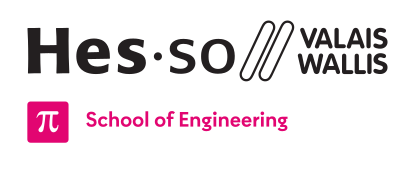

<h1 align="center">
   
  
   
  
   
  HEI-Vs Engineering School - DiD Digital Design
   
</h1>

Welcome to the GitHub organization for the [HEI-Vs Engineering School](https://hevs.ch/synd) in Sion, Switzerland. This organization is dedicated to the course "DiD Digital Design" for the orientation Synd aka [Industrial Systems](https://hevs.ch/synd).

## Repositories

Here are the repositories available in this organization:

- [did-docs](https://github.com/hei-synd-did/did-docs): This repository contains all the course materials, including lecture slides, scipts, exercises, laboratory and projects documents.
- [did-labs](https://github.com/hei-synd-did/did-labs): This repository contains additional resources for the laboratories.
- [did-kart-ebs3](https://github.com/hei-synd-did/did-kart-ebs3): This repository contains the HDL Project for the SummerSchool I R/C Kart Project.
- [did-cursor](https://github.com/hei-synd-did/did-cursor): This repository contains the HDL Project and additional resources for the Semester Project Cursor.
- [did-chrono](https://github.com/hei-synd-did/did-chrono): This repository contains the HDL Project and additional resources for the Semester Project Chrono.

## Contributing

We welcome contributions from students and faculty members of HEI-Vs Engineering School. If you would like to contribute to any of the repositories in this organization, please follow these steps:

1. Fork the repository you want to contribute to.
2. Create a new branch for your feature or bug fix.
3. Make your changes and commit them with descriptive messages.
4. Push your branch to your forked repository.
5. Open a pull request in the original repository and describe your changes.

Please ensure that you follow the code of conduct and guidelines for contributing as outlined in each repository.

## Issues and Support

If you encounter any issues or have questions regarding the course or any of the repositories, please feel free to open an issue in the respective repository. Our team will be happy to assist you.

## Last Word

Thank you for being a part of the HEI-Vs Engineering School GitHub organization. Happy coding!

## Find us on

[hevs.ch](https://www.hevs.ch) &nbsp;&middot;&nbsp;
Facebook [@hessovalais](https://www.facebook.com/hessovalais) &nbsp;&middot;&nbsp;
Twitter [@hessovalais](https://twitter.com/hessovalais) &nbsp;&middot;&nbsp;
LinkedIn [HES-SO Valais-Wallis](https://www.linkedin.com/groups/104343/) &nbsp;&middot;&nbsp;
Youtube [HES-SO Valais-Wallis](https://www.youtube.com/user/HESSOVS)